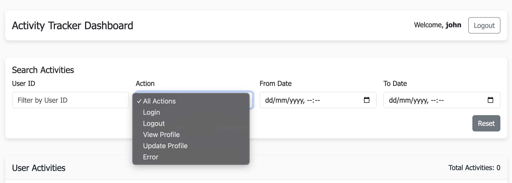

# Real-Time User Activity Tracker

A Spring Boot application that allows tracking and viewing user activities in real-time.



## Features

- Real-time activity tracking via WebSockets
- REST API for activity management
- JWT-based authentication
- Caching with Redis
- Database migrations with Flyway
- Comprehensive unit tests

## Tech Stack

### Backend
- Java 21
- Spring Boot 3.1.5
- Spring Security
- Spring Data JPA
- WebSocket (STOMP)
- PostgreSQL
- Flyway for database migrations
- Redis for caching
- JUnit 5 & Mockito for testing
- JWT for authentication

### Frontend
- Angular 16
- NgRx for state management
- HttpClient for HTTP requests
- SockJS/STOMP for WebSockets
- RxJS for reactive programming
- Angular Material (optional) for UI components
- TypeScript for type-safe development

## Getting Started

### Prerequisites
- Java 17 or later
- Maven
- Redis (for caching)
- PostgreSQL

### Setup and Installation

1. Clone the repository:
```bash
git clone https://github.com/thurpes/activity-tracker.git
cd activity-tracker
```

2. Configure PostgreSQL:
   - Create a database for the application
   - Update the database configuration in `application.properties`

3. Build the project:
```bash
mvn clean install
```

4. Run the application:
```bash
mvn spring-boot:run
```

5. Access the application at `http://localhost:8080`
6. Access Swagger UI at `http://localhost:8080/swagger-ui.html`

### Configuration

The application can be configured using the following properties files:

- `application.properties`: Default configuration
- `application-dev.properties`: Development environment configuration
- `application-prod.properties`: Production environment configuration

To use a specific profile, set the active profile:
```bash
mvn spring-boot:run -Dspring.profiles.active=prod
```

#### Database Configuration

For PostgreSQL:
```properties
spring.datasource.url=jdbc:postgresql://localhost:5432/activitydb
spring.datasource.username=postgresusername
spring.datasource.password=yourpassword
spring.jpa.properties.hibernate.dialect=org.hibernate.dialect.PostgreSQLDialect
```

#### Redis Configuration
```properties
spring.cache.type=redis
spring.redis.host=localhost
spring.redis.port=6379
```

## API Documentation

The application includes comprehensive API documentation using Swagger/OpenAPI:

- Access the Swagger UI at: `http://localhost:8080/swagger-ui.html`
- API documentation in JSON format: `http://localhost:8080/v3/api-docs`

The Swagger UI provides an interactive interface to:
- View all available endpoints
- Test API endpoints directly from the browser
- See request and response formats
- View authentication requirements

### Authentication

#### Login
```
POST /api/auth/login
Content-Type: application/json

{
  "username": "admin",
  "password": "john123"
}
```

Response:
```json
{
  "token": "eyJhbGciOiJIUzI1NiJ9...",
  "type": "Bearer",
  "id": 1,
  "username": "admin",
  "email": "admin@example.com"
}
```

### Activity Endpoints

#### Log Activity
```
POST /api/activities
Authorization: Bearer {token}
Content-Type: application/json

{
  "userId": 1,
  "action": "LOGIN",
  "description": "User logged in"
}
```

#### Get All Activities
```
GET /api/activities?page=0&size=10&sort=createdAt
Authorization: Bearer {token}
```

#### Get User Activities
```
GET /api/activities/user/{userId}?page=0&size=10
Authorization: Bearer {token}
```

#### Get Recent Activities
```
GET /api/activities/recent
Authorization: Bearer {token}
```

#### Search Activities
```
GET /api/activities/search?userId=1&action=LOGIN&startDate=2023-01-01T00:00:00&endDate=2023-12-31T23:59:59&page=0&size=10
Authorization: Bearer {token}
```admin@example.com"
}
```

### Activity Endpoints

#### Log Activity
```
POST /api/activities
Authorization: Bearer {token}
Content-Type: application/json

{
  "userId": 1,
  "action": "LOGIN",
  "description": "User logged in"
}
```

#### Get All Activities
```
GET /api/activities?page=0&size=10&sort=createdAt
Authorization: Bearer {token}
```

#### Get User Activities
```
GET /api/activities/user/{userId}?page=0&size=10
Authorization: Bearer {token}
```

#### Get Recent Activities
```
GET /api/activities/recent
Authorization: Bearer {token}
```

#### Search Activities
```
GET /api/activities/search?userId=1&action=LOGIN&startDate=2023-01-01T00:00:00&endDate=2023-12-31T23:59:59&page=0&size=10
Authorization: Bearer {token}
```

### WebSocket Endpoints

#### Connect to WebSocket
```
ws://localhost:8080/ws
```

#### Subscribe to Activity Updates
```
/topic/activities
```

## Running with Swagger UI

After starting the application, you can access the Swagger UI at `http://localhost:8080/swagger-ui/index.html`. This provides:

1. **Interactive Documentation**: Test all REST endpoints directly from your browser
2. **Request/Response Examples**: See example payloads for each endpoint
3. **Authentication Support**: Use the Authorize button to add your JWT token
4. **Schema Documentation**: View detailed models and field descriptions

### Using Swagger UI for Authentication:

1. Navigate to the `/api/auth/login` endpoint
2. Click "Try it out" and enter credentials (e.g., username: "admin", password: "john123")
3. Execute the request to receive a JWT token
4. Click the "Authorize" button at the top of the page
5. Enter the token with format: `Bearer {your-token}`
6. Now you can test secured endpoints

## Assumptions Made

1. Authentication is required for most API endpoints except for login
2. WebSocket communication requires authentication
3. PostgreSQL is used as the primary database
4. Cache eviction happens when activities are logged
5. For simplicity, no role-based authorization is implemented (could be added as an enhancement)

## Areas for Improvement

Given more time, these areas could be improved:

1. **Role-based Authorization**: Add role-based access control for different user levels
2. **Mapstruct**: Reduces boilerplate and abstracts implementation details making the DTO-to-entity mapping more maintainable and less error-prone.
3. **Enhanced API Documentation**: Expand Swagger documentation with more examples and descriptions
4. **Metrics & Monitoring**: Add Actuator endpoints for health checks, metrics, and monitoring
5. **Enhanced Testing**: Add integration tests and improve test coverage
6. **Rate Limiting**: Implement rate limiting for APIs to prevent abuse
7. **Email Notifications**: Add notification service for important activities
8. **Audit Logging**: Enhanced audit logging for sensitive operations
9. **Batch Processing**: Implement batch processing for activity data analysis
